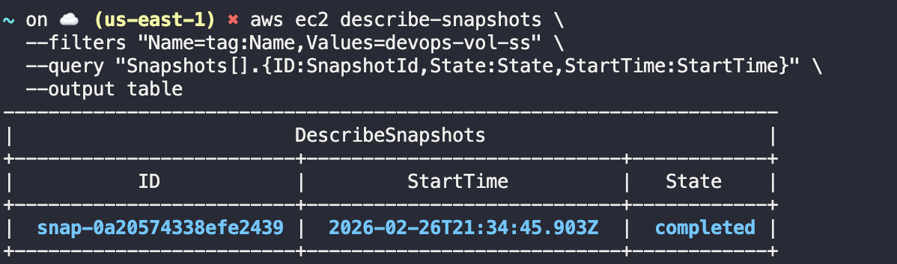

# Creating an EBS VOlume Snapshot

create a snapshot of an already-existing volume named 'devops-vol' in the us-east-1 region

the snapshot should be named 'devops-vol-ss'

it should have a description of 'devops Snapshot'

make sure the snapshot is in the completed state before submitting


## get the volume id

```bash
aws ec2 describe-volumes --filters "Name=tag:Name,Values=devops-vol" --query "Volumes[].VolumeId" --output text
```

## create the snapshot

```bash
aws ec2 create-snapshot --volume-id <volume-id> --description "devops Snapshot" --tag-specifications "ResourceType=snapshot,Tags=[{Key=Name,Value=devops-vol-ss}]"
``` 

## verify the snapshot

```bash
aws ec2 describe-snapshots --filters "Name=tag:Name,Values=devops-vol-ss" --query "Snapshots[].State" --output text
```


