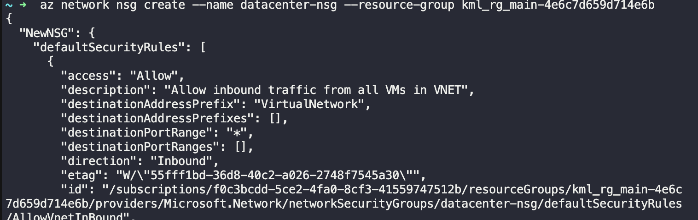
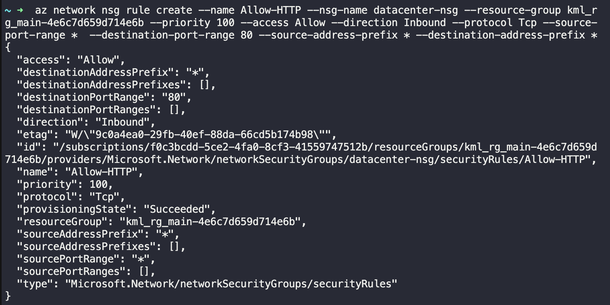
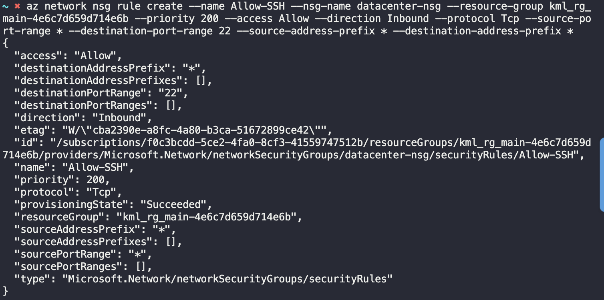

# Creating and Configuring NSG in Azure

For this task, create a network security group (NSG) with the following requirements:

Name of the NSG should be datacenter-nsg.

Add an inbound security rule named Allow-HTTP for HTTP service on port 80, with the source CIDR range of 0.0.0.0/0.

Add another inbound security rule named Allow-SSH for SSH service on port 22, with the source CIDR range of 0.0.0.0/0.


## get the resource group name

```bash
az group list --output table
```

--> kml_rg_main-4e6c7d659d714e6b


## create the NSG

```bash
az network nsg create --name datacenter-nsg --resource-group kml_rg_main-4e6c7d659d714e6b
```




## add the inbound security rules

```bash
az network nsg rule create --name Allow-HTTP --nsg-name datacenter-nsg --resource-group kml_rg_main-4e6c7d659d714e6b --priority 100 --access Allow --direction Inbound --protocol Tcp --source-port-range * --destination-port-range 80 --source-address-prefix * --destination-address-prefix *
```



```bash
az network nsg rule create --name Allow-SSH --nsg-name datacenter-nsg --resource-group kml_rg_main-4e6c7d659d714e6b --priority 200 --access Allow --direction Inbound --protocol Tcp --source-port-range * --destination-port-range 22 --source-address-prefix * --destination-address-prefix *
```

